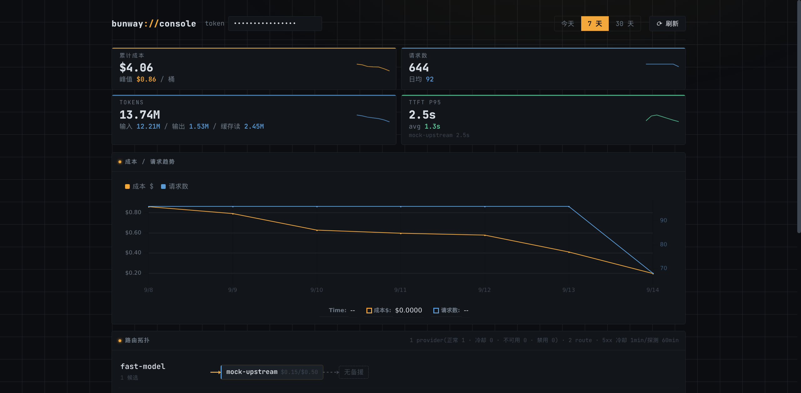

# bunway

> A self-hosted LLM gateway on Bun: one container, zero runtime dependencies, OpenAI-compatible API with priority failover, SQLite cost tracking, and a built-in console.

**bunway is not affiliated with, endorsed by, or connected to the Bun project or Oven.**



## Quick start

No API key needed — the demo ships a mock upstream and pre-seeded data:

```bash
git clone https://github.com/35iter-cn/bunway
cd bunway
docker compose -f demo/docker-compose.yml up -d
```

Open http://127.0.0.1:3101/console (token: `demo-admin-token`), then send a real request through the gateway:

```bash
curl -sN http://127.0.0.1:3101/v1/chat/completions \
  -H "Authorization: Bearer sk-demo" \
  -H "Content-Type: application/json" \
  -d '{"model":"fast-model","messages":[{"role":"user","content":"hi"}]}'
```

## Why bunway

- **Priority failover** — routes try upstreams in priority order; 4xx/5xx classification marks providers unavailable or puts them in cooldown, and traffic spills over automatically.
- **Zero runtime dependencies** — the gateway is plain TypeScript on Bun (`bun:sqlite`, `Bun.serve`); nothing to npm-audit, nothing to break.
- **SQLite billing + built-in console** — every request is priced per token (input/output/cache read/cache write) and stored in SQLite; the single-container dashboard shows KPIs, trends, per-provider routing state, and error events.

## Docs

- Deploy & verify (step by step, with expected output): [docs/deploy.md](docs/deploy.md)
- Gateway reference (endpoints, provider config, failover, pricing): [docs/gateway.md](docs/gateway.md)
- Using a coding agent? Point it at [llms.txt](llms.txt)
- 中文文档: [README.zh-CN.md](README.zh-CN.md)

## License

MIT. Bundled frontend dependencies (uplot, svelte, vite) are MIT as well.