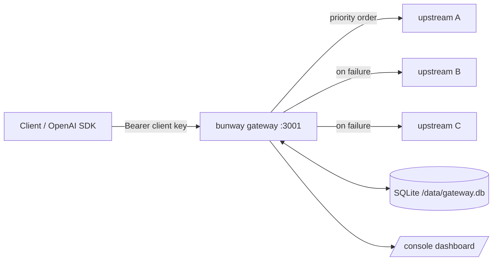

# Gateway reference

How bunway routes, relays, and bills requests — the reference for connecting
your real providers once the gateway is running. Deployment steps live in
[deploy.md](deploy.md); this page explains what to configure and why.

## Architecture



One process serves everything: the OpenAI-compatible relay, the admin API,
and the dashboard. All state (providers, routes, keys, usage, cost) lives in a
single SQLite file.

## Client API

All client-facing endpoints authenticate with a **client key**:
`Authorization: Bearer sk-...` (keys are managed under `/admin/keys`).

| Endpoint | Purpose |
|---|---|
| `POST /v1/chat/completions` | OpenAI chat completions, streaming and non-streaming; SSE usage is extracted for billing |
| `POST /v1/responses` | OpenAI Responses API, same billing path |
| `GET /v1/models` | Lists every `gateway_model` that has at least one route |

Point any OpenAI SDK at the gateway by changing the base URL to
`http://<host>:3001/v1` and the API key to a client key.

## Admin API

Everything under `/admin/*` authenticates with the **admin token** (the
`GATEWAY_ADMIN_TOKEN` you configured at deploy time). The console at
`/console` uses the same token in-page.

| Endpoint | Purpose |
|---|---|
| `GET/POST /admin/providers`, `GET/PUT/DELETE /admin/providers/:id` | Upstream providers; `POST`/`PUT` accept an optional `routes` array (PUT with `routes` replaces all of that provider's routes) |
| `GET/POST /admin/routes`, `PUT/DELETE /admin/routes?gateway_model=&provider_id=&provider_model=` | Single-route CRUD; `PUT` with query params edits one route in place |
| `GET/POST /admin/keys`, `PUT/DELETE /admin/keys/:id` | Client keys callers authenticate with |
| `GET/PUT /admin/settings` | Runtime settings (`test_interval_minutes`, cooldown minutes) |
| `GET /admin/stats?range=today\|7d\|30d` (or `?since=&until=` epoch ms) | Per (model, provider) requests/cost/tokens/latency/TTFT |
| `GET /admin/stats/timeseries?range=…&tz=` | Bucketed cost/request series for charts |
| `GET /admin/errors?range=…&limit=` | Recent error events (JSONL logs, kept 7 days) |
| `GET /admin/ttft?since=&until=&tz=` | Global and per-provider TTFT p95 |

## Connecting a provider

```json
{
  "name": "deepseek",
  "base_url": "https://api.deepseek.com",
  "api_key": "sk-...",
  "meta": {},
  "routes": [
    {
      "gateway_model": "deepseek-flash",
      "provider_model": "deepseek-chat",
      "priority": 10,
      "pricing": { "default": { "price_input": 0.3, "price_output": 1.2, "price_cache_read": 0.006, "price_cache_write": 0 } }
    }
  ]
}
```

`POST` it to `/admin/providers` (or `PUT /admin/providers/:id` to update).
`gateway_model` is the name your clients ask for; `provider_model` is what gets
sent upstream; `priority` orders candidates for the same `gateway_model`
(higher is tried first).

### base_url rule

The gateway appends `/v1/chat/completions` to `base_url`. **`base_url` is the
host root without `/v1`**:

| Upstream | base_url |
|---|---|
| OpenAI | `https://api.openai.com` |
| DeepSeek | `https://api.deepseek.com` |
| Ollama | `http://localhost:11434` |
| a self-hosted gateway that already includes `/v1` in its URL | strip the `/v1` |

### Headers the upstream requires

Some upstreams reject requests without specific headers (an account/session
header, a browser-like `user-agent` behind Cloudflare). List them in the
provider's `meta` and the gateway forwards matching client headers upstream:

```json
{ "meta": { "forward_headers": ["x-opencode-session", "user-agent"] } }
```

`meta` is only settable through the admin API (`meta` field on provider
create/update); there is no console editor for it yet.

### Multiple providers for one model (failover)

Register several providers, each with a route for the same `gateway_model` and
a descending `priority`:

```json
[
  { "name": "primary",   "base_url": "https://api.deepseek.com", "api_key": "sk-...",
    "routes": [{ "gateway_model": "fast", "provider_model": "deepseek-chat", "priority": 10,
                 "pricing": { "default": { "price_input": 0.3, "price_output": 1.2, "price_cache_read": 0.006, "price_cache_write": 0 } } }] },
  { "name": "backup",    "base_url": "http://localhost:11434", "api_key": "ollama",
    "routes": [{ "gateway_model": "fast", "provider_model": "qwen3:14b", "priority": 5,
                 "pricing": { "default": { "price_input": 0, "price_output": 0, "price_cache_read": 0, "price_cache_write": 0 } } }] }
]
```

Failover behavior, per request:

| Upstream outcome | Classification | Effect |
|---|---|---|
| Connection error / timeout / network failure | `cooldown` | Try next provider; this one cools down (default 1 min) |
| HTTP 5xx | `cooldown` | Same as above |
| HTTP 400 / 404 / 422 | `nofailover` | Returned to the client as-is; the provider is *not* penalized (the request itself is invalid, switching would not help) |
| HTTP 401 / 403 / 429 | `unavailable` | Provider is pulled from rotation until a probe succeeds |

Providers marked `unavailable` are probed every `test_interval_minutes`
(default 60); a successful probe puts them back in rotation. Current runtime
state (unavailable / cooldown countdown / disabled) is visible in the console
routing panel and in `GET /admin/providers`.

## Pricing

Every route carries a `pricing` object; amounts are **USD per million
tokens**:

```json
{
  "default": { "price_input": 0.3, "price_output": 1.2, "price_cache_read": 0.006, "price_cache_write": 0 },
  "rules": [
    { "windows": ["01:00-04:00", "06:00-10:00"], "days": [1, 2, 3, 4, 5],
      "price_input": 0.15, "price_output": 0.6, "price_cache_read": 0.003 }
  ]
}
```

- `default` is the always-on price; each rule overrides the four prices during
  its windows (UTC `HH:MM-HH:MM`, end may be `24:00`) and optional `days`
  (`0` = Sunday … `6` = Saturday, UTC). First matching rule wins.
- Usage is attributed per request from the upstream's `usage` chunk; requests
  without usage still count but cost 0.

## Security model

- `/v1/*` requires a client key; `/admin/*` and `/console` require the admin
  token (entered in-page; `/console` HTML itself is served without auth by
  design).
- The admin surface is for trusted networks only — see
  [SECURITY.md](../SECURITY.md) before exposing anything.